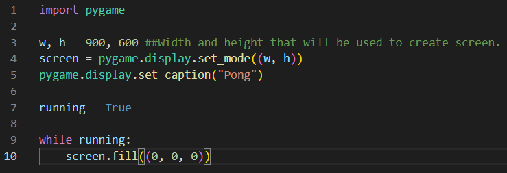
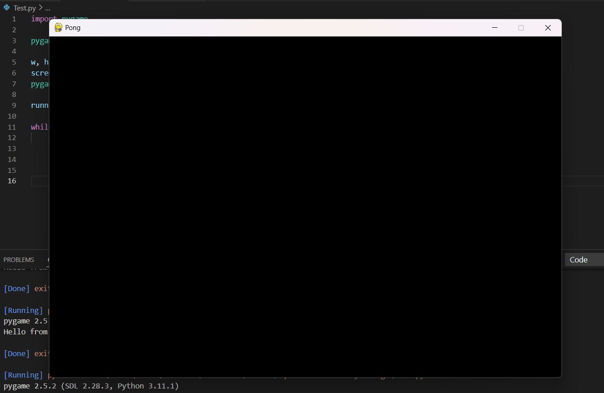
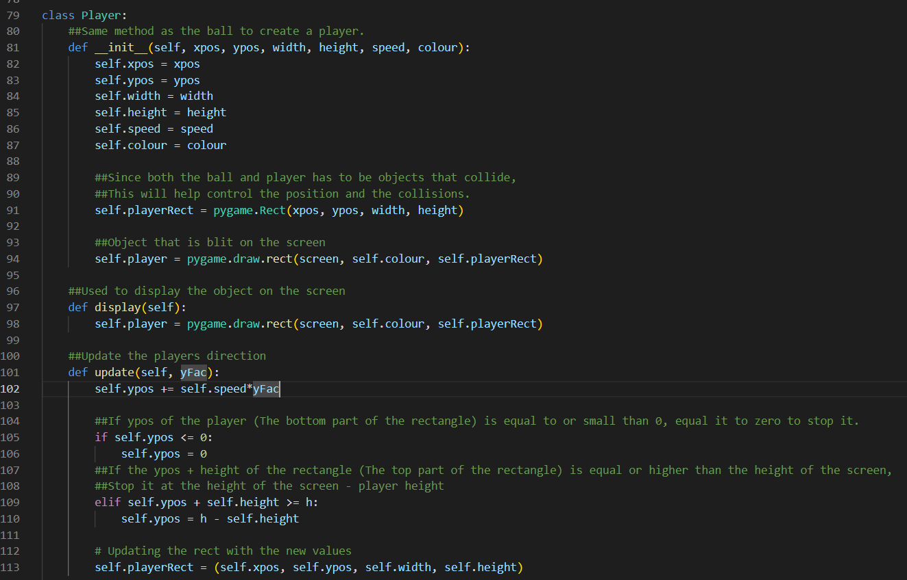
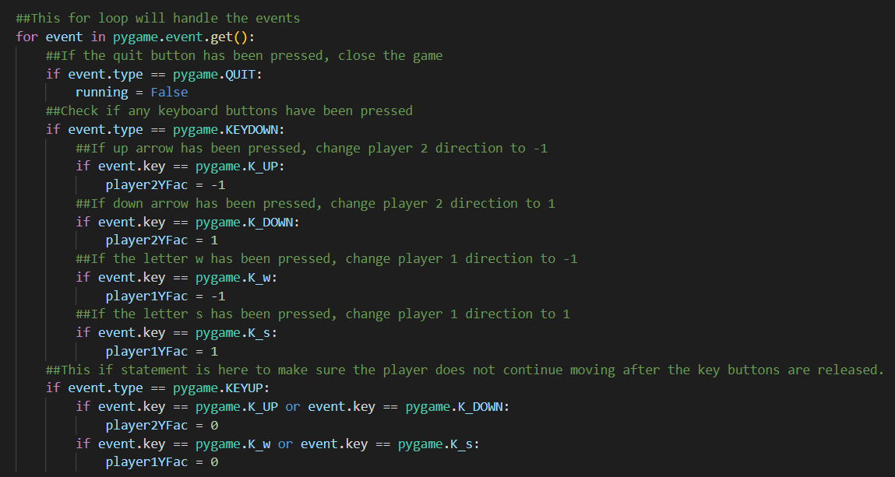

# Library selection

Pygame is a cross-platform set of Python modules designed for writing video games. It includes computer graphics and sound libraries design to be used with the python programming language. For our purposes we will be concentrating to GUI part of the pygame instead of the sound libraries.

Just like any other language python can use different kind of libraries/packages to create windows, buttons, objects, or slides. Pygame does the similar job but mostly used for game designing purposes. The biggest example of games that have been written with pygame are FlappyBird, Bomberman, TicTacToe, Sudoku, and Pong as shown in our code. 

# Starting to use pygame

Lets take the use of pygame step by step:[^1] 

## Step 1: Installation

As anything should start, we need to install the library to use. To accomplish we can use two different ways:
```
pip install pygame
```
or
```
pip3 install pygame
```

I have noticed that the first method did not work when I have tried running my code with it, hence I suggest using the second method to be used.

## Step 2: Implementing a Background in Pygame

As any good game starts, we will need a background. For the purpose of learning pygame, the correct way to approach this would be to create small programs that do simple one feature, and when you have a grasp of it better you can combine them together.

For this purpose I have created a new python file called Test.py:



This code above does a few simple tasks:

    1. Initializes pygame with init()
    2. Sets the screen dimensions with display.set_mode()
    3. Sets the screen title with display.set_caption()
    4. And lastly it fills the screen with one colour. In this step we can change it so it actualy loads an image instead as well.

(When loading an image instead of filling it with one colour, the image requires to be in the same folder.)

Now, lets see what we get once we run this code with (0, 0, 0) -> Black colour filling:



## Step 3: Adding the players

For the purpose of adding objects into our game (screen), we will be adding players in the shape of rectangles that user will be commanding via either up and down arrows or letters W and S. We can create a new class called player with the following code: 



The above code defines the a few key factors of the player:

    a. x-position and y-position of the player. Of course, for the purpose of this game we will only need y-position to be changing and x-position to be the same for the entire game.
    b. width and height. Just like the x-position, these won't be changing for the rest of the game but we will require height to check if the player hits the boundries.
    c. Speed and colour. Colour will be only helpful to separate it from the screen and the ball. Speed on the other hand is required to see how much it displaces when player moves.

Defined display only does a simple job of displaying the player where it has been specified to and defined update will be a key function that updates players direction and possition. Also this is where we will make sure that player does not go off boundry. 

## Step 4: Running the game and enjoying

Assuming you have included a class for ball as well now we can include a main program code. Here there has to be included a few key features. Defining both player and the ball with the proper parameters you have picked and detecting which keys have been pressed or not. I will include a screenshot of the second part of this statement since that will have pieces of pygame we have not seen yet:



Here we can see that in the for loop first if statement checks if quit button has been pressed, if it has been then it will turn of the game and stop the code. This is achived by taking the pygame.event.get(), which will look for any activity in the keyboard and mouse. 

After that second if statement will check if any keyboard keys has been pressed by checking with pygame.KEYDOWN. This requires a few if statements to see if the required keys have been pressed and tell the code what to do when it is.

Last if statement here will check the release of the keys with pygame.KEYUP. This will be used to stp the rectangle player on the screen to stop moving when the specified keys are released.

# Background knowledge and personal opinions

This specific library in python has been created in October 28th of 2000, 6 months later pygame version 1.0 was released. Pete Shinners, the creator of PyGame, has found a similar library called PySDL that was under-way with the same idea. After studying and understanding PySDL more he felt like it forced a C style of code, by he wanted to put together a project that really took advantage of Python. His goal was to make it easy to do the simple things, and straightforward to do the difficult things.[^2]

When it comes to why this specific library has pulled my attention and that I decided to do this library is very simple in the core. As much as I used python in my Physics Degree for lab purposes, I have always been a gamer in heart and Java was the first language I have learned properly from following a scheculed teaching or in a proper class. Hence I wanted to experience with a language that I require to know for my degree and my future but be able to use this language to multiple different ways. As most people do, I used python for calculations, graphing and advance data collection, hence I knew that python is able to creat GUI or windows in a great and simple way to understand for most students. 

With learning how to code a simple game with this library, it makes learning GUIs, function and class creation more fun. 

Biggest recommendation to use this library would be for game designing while using python as it states in the name (PyGame) but I noticed that this language can be used for rendering images to the screen, handling button presses, or tracking mouse movements. Of course, I will use this library again when the oppurtunity presents itself, because I know that the more I use the library more I will understand how a language can be different from other languages. As mentioned above Peete Shinners compared this language to PySDL, and that PySDL has felt like it was from C type of language. I would like to spend more time understanding that library as well so I can see the differences even more.

<sub>
References:
</sub>

[^1]: Same websites Front Page was used to learn about differnt methods included in the PyGame. 
https://www.pygame.org/docs/

[^2]: This paragraph has been mostly rewritten from the website for PyGame that has been written by Pete Shinners. 
https://www.pygame.org/docs/tut/PygameIntro.html#:~:text=Pygame%20was%20started%20in%20October,pygame%20version%201.0%20was%20releasedS
