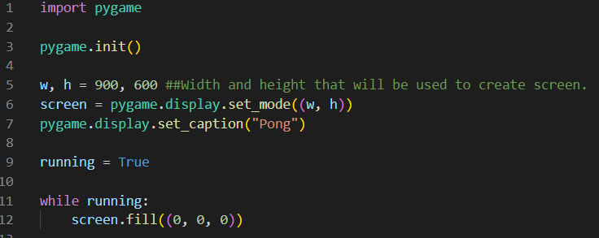

# Library selection

Pygame is a cross-platform set of Python modules designed for writing video games. It includes computer graphics and sound libraries design to be used with the python programming language. For our purposes we will be concentrating to GUI part of the pygame instead of the sound libraries.

Just like any other language python can use different kind of libraries/packages to create windows, buttons, objects, or slides. Pygame does the similar job but mostly used for game designing purposes. The biggest example of games that have been written with pygame are FlappyBird, Bomberman, TicTacToe, Sudoku, and Pong as shown in our code. 

# Starting to use pygame

Lets take the use of pygame step by step: 

## Step 1: Installation

As anything should start, we need to install the library to use. To accomplish we can use two different ways:
```
pip install pygame
```
or
```
pip3 install pygame
```

I have noticed that the first method did not work when I have tried running my code with it, hence I suggest using the second method to be used.

## Step 2: Implementing a Background in Pygame

As any good game starts, we will need a background. For the purpose of learning pygame, the correct way to approach this would be to create small programs that do simple one feature, and when you have a grasp of it better you can combine them together.

For this purpose I have created a new python file called Test.py:



This code above does a few simple tasks:

    1. Initializes pygame with init()
    2. Sets the screen dimensions with display.set_mode()
    3. Sets the screen title with display.set_caption()
    4. And lastly it fills the screen with one colour. In this step we can change it so it actualy loads an image instead as well.

(When loading an image instead of filling it with one colour, the image requires to be in the same folder.)

Now, lets see what we get once we run this code with (0, 0, 0) -> Black colour filling:


## Step 3: Adding the players

For the purpose of adding objects into our game (screen), we will be adding players in the shape of rectangles that user will be commanding via either up and down arrows or letters W and S. We can create a new class called player with the following code: 


The above code defines the a few key factors of the player:

    a. x-position and y-position of the player. Of course, for the purpose of this game we will only need y-position to be changing and x-position to be the same for the entire game.
    b. width and height. Just like the x-position, these won't be changing for the rest of the game but we will require height to check if the player hits the boundries.
    c. Speed and colour. Colour will be only helpful to separate it from the screen and the ball. Speed on the other hand is required to see how much it displaces when player moves.

Defined display only does a simple job of displaying the player where it has been specified to and defined update will be a key function that updates players direction and possition. Also this is where we will make sure that player does not go off boundry. 

